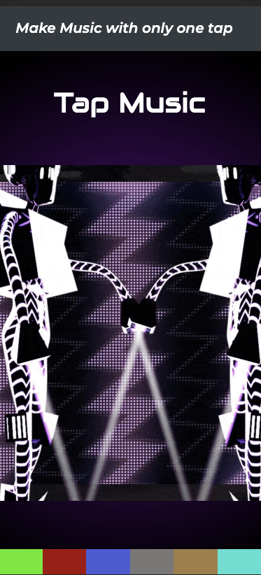

# beat_maker
This is a music app from scratch with vanilla javascript, css and html.  In this vanilla javascript project we are going to take a look at how we can implement an audio track and add different sounds to it.

